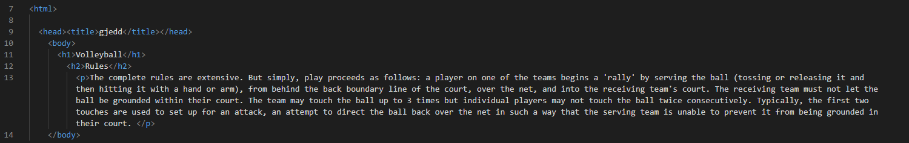

# About the Program Creator

My name is Jake Smith and I am the creator of this program. The purpose of this is for my midterm assignment in one of my Information Technology classes at the University of Missouri.

I am currently learning Python, JavaScript, and HTML. Here is how I would have coded the rules paragraph in the [introduction] in an HTML syntax:

Since VS Code will not allow the HTML program to properly display itself without a screenshot.

To go learn about a position, select one below:

[Outside/Opposite Hitter](https://github.com/JakeSmith1109/Midterm-Project/blob/main/outside_opposite.md)

[Middle](https://github.com/JakeSmith1109/Midterm-Project/blob/main/middle.md)

[Libero](https://github.com/JakeSmith1109/Midterm-Project/blob/main/libero.md)

[Setter](https://github.com/JakeSmith1109/Midterm-Project/blob/main/setter.md)

Or, go back [home.](https://github.com/JakeSmith1109/Midterm-Project.git)